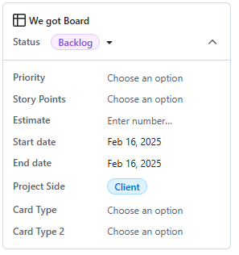

# WeGotBoard-PM
*!! Repo for project management tickets only !!*

## WeGotBoard Project guidelines

***All issues/branches need to be created through Github Projects, do not create new issues/branches from one of the repos or external git managers. This creates ease of use with minimal mistakes and later cleanup.***

### Tags

#### Priority

*This is an optional tag*, "[Story Points](#story-points)" is a more important tag that practically does the same thing in a different way.  
Options:  
+ Critical : Needs to be taken care of immediately
+ High : Progress needed as soon as possible
+ Medium : Progress needed but not urgently
+ Low : This can wait

#### Story Points

***Required tag for every feature***

Options:
+ SP1 : Small feature, can be taken care of first
+ SP2 : Slightly larger feature, can still be taken care of first
+ SP3 : Medium sized feature, might need more work and can wait until smaller features are finished
+ SP5 : Large or important feature, needs a lot of work and can span multiple coding sessions
+ SP8 : Really big or really important feature, will take a lot of your precious hours, multiple other features might depend on its progress or vice versa

#### Project Side

***Required tag for every issue (features, epics and other)***

This tag is related to the branch the issue is created on/for. Mainly used to filter the backlog if needed.  

Options:
+ Client : The pages customers would see (issues on [WeGotBoard-front](https://github.com/DQuinn97/WeGotBoard-front))
+ Admin : The pages admin users would see (issues on [WeGotBoard-back](https://github.com/DQuinn97/WeGotBoard-back))
+ Project Management : Administrative actions from the group members (issues on [WeGotBoard-PM](https://github.com/DQuinn97/WeGotBoard-PM))

#### Card Type

***Required tag for every feature***

This tag describes the primary type of the created issue.  

Options:
+ Epic : Full page / collection of user-stories
+ Feature : Functioning code (one user-story)
+ Bug : Feature with unwanted behaviour (features that don't work need this tag so another collaborator can create a hotfix issue)
+ Hotfix : Issue created to specifically deal with a bug

#### Card Type 2

***Required tag for every feature with the feature "Card Type"***

This tag describes the nature of the feature. If a collaborator only created a design, a new issue can later be created with a back-end tag for example.

Options:
+ Full feature: Design + back-end
+ Design : Just the design
+ Back-end : Just the code in the back-end

### Repos

Please use each repo for its appropriate use:
+ WeGotBoard-front for all client-side features, even if they would make an API call to the admin-side
+ WeGotBoard-back for all admin-side only features (so the API and DB itself)
+ WeGotBoard-PM for all contributor issues related to Project Management (setting up repos, sprints, raw documentation, ...)

Combined with using the right repo, also tag the repo in the "Project Side" tags for easier filtering later on if needed.

### Epics

An **epic** describes multiple (larger) features that form one unit (like a full webpage).
The epic needs to be created on the appropriate repo.    
Each epic needs to be divided into sub-issues that each form one singular user-story (details in [User-Stories](#user-stories)).   

Please also mark epics with the right tag under "Card Type", it does not need a "Card Type 2":  

### User-Stories

A **user-story** describes one singular feature in detail.  
Each story has one function and one function only, if it does multiple things, it needs to be split up. Do this with only a singular new issue, and editing the old one. Do not make two new sub-issues for one story that happened to be too large, this will cause cascading issues later and does not follow the agile mindset.
> ~"I want to be able to filter and sort the storefront so that I can find what I need"~    -> "I want to be able to filter" + "I want to be able to sort"  
> **NOT** -> "I want to be able to filter and sort" + "I want to be able to filter" + "I want to be able to sort"

User-stories need a "[Story Points](#story-points)" *(and optionally a "[Priority](#priority)")*, a "[Project Side](#project-side)", a "[Card Type](#card-type)" and "[Card Type 2](#card-type-2)" tag.  
 *(usage for each of these tags is listed in [Tags](#tags))*

### Bugs and Hotfixes

A **bug** is a regular feature one of the collaborators is working on but got stuck. If a card got marked as a bug using the appropriate "[Card Type](#card-type)", another collaborator is invited to create a sub-issue with the **hotfix** tag.  
A **hotfix** is only ever created as a response to a bug.

### Naming Cards

All cards/issues must start with "wgb", followed by the card type specific naming convention specified below.  
Names are allowed to have spaces, git will automatically truncate this for branches. Git will also automatically generate a ticket ID per repo, so that can be ignored in the creation of the card. Do not change the automatically generated name of each branch, changing it may cause confusion.  
+ Epics : `wgb EPIC_<page name / issue collection name>`
+ Feature : `wgb_<feature name>`
+ Bug : not named, just a tag. This is already an existing branch / issue.
+ Hotfix : `wgb HF_<parent issue name>`

### Branching

***Do not develop on main, main is only ever to be used to merge finished epics / features / hotfixes.***
+ Epics : branch off from main
+ Features : branch off from their parent epic or main if not applicable
+ Hotfixes : branch off from their parent issue
